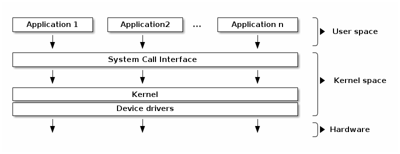
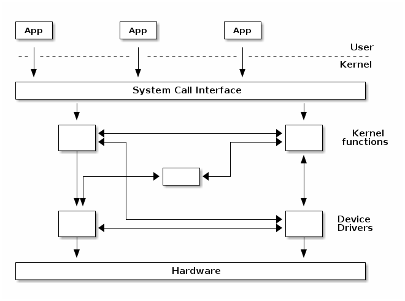
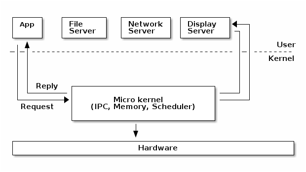
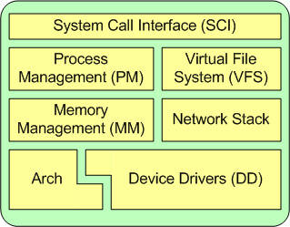
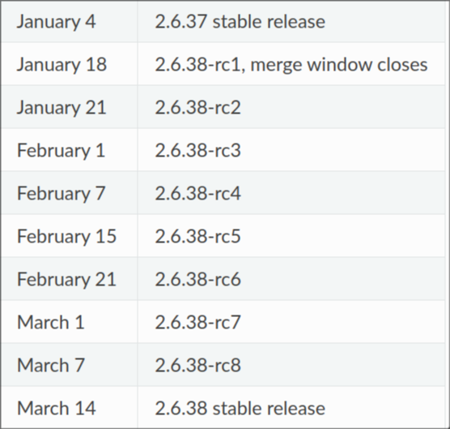

# The Linux Kernel

## Recap

- User Space
- Kernel Space
  - System Call Interface
  - Device Drivers

## Linux: The Monolithic Kernel

Linux is a **monolithic** kernel. Let's unpack what this means.

### Monolithic kernels

Monolithic kernel is a single large process running entirely in a single address space. It is a single binary file. All kernel services exist and execute in the kernel address space. The kernel can invoke functions directly. Examples of monolithic kernel based OSs: Unix, Linux.

### Microkernels

A **microkernel** prefers an approach where core functionality is isolated from system services.

In microkernels, the kernel is broken down into separate processes, known as servers. Some of the servers run in kernel space and some run in user-space. All servers are kept separate and run in different address spaces. Servers invoke "services" from each other by sending messages. This separation has the advantage that if one server fails, other servers can still work efficiently. Examples of microkernel based OSs: Mac OS X and Windows NT.

Here's an interesting resource to read if you're curious as to why Linux is a monolithic kernel, documenting a debate between him and Andrew Tanenbaum, a well-respected OS researcher. [2]

## Major Subsystems of the Linux Kernel

The Linux kernel, being monolithic, carries out a lot of different functionalities. These functionalities are grouped into subsystems.[3]

### 1. System Call Interface

The SCI is a thin layer that provides the means to perform function calls from user space into the kernel.

### 2. Process management

Process management is focused on the **execution of processes**.

In the kernel, these are called threads and represent an individual virtualization of the processor (thread code, data, stack, and CPU registers).

The kernel provides an application program interface (API) through the SCI to create a new process (fork, exec), stop a process (kill, exit), and communicate and synchronize between them (signals).

Also in process management is the need to share the CPU between the active threads. This is done via a **scheduling algorithm**.

The Linux kernel implements a scheduler called EEVDF.[5]

### 3. Memory management

The physical memory in a computer system is a limited resource. The physical memory is not necessarily contiguous; it might be accessible as a set of distinct address ranges. Besides, different CPU architectures, and even different implementations of the same architecture have different views of how these address ranges are defined.

All this makes dealing directly with physical memory quite complex and to avoid this complexity a concept of virtual memory was developed.

The virtual memory abstracts the details of physical memory from the application software, allows to keep only needed information in the physical memory (demand paging) and provides a mechanism for the protection and controlled sharing of data between processes.

For efficiency, given the way that the hardware manages virtual memory, memory is managed in what are called pages (4KB in size for most architectures). Linux includes the means to manage the available memory, as well as the hardware mechanisms for physical and virtual mappings.

Supporting multiple users of memory, there are times when the available memory can be exhausted. For this reason, pages can be moved out of memory and onto the disk. This process is called swapping because the pages are swapped from memory onto the hard disk.

Linux is often accused of [eating your RAM](https://www.linuxatemyram.com).

---

# Linux Kernel Development Process

Now we pose the question: how on earth is a project of this scale and maintained?

- The kernel developers use a loosely time-based release process, with a new major kernel release happening every two or three months. [4]
- It uses a **rolling development model** which is continually integrating major changes.

#### Does the major release number (4.x vs 5.x) mean anything ?

No. The major version number is incremented when the number after the dot starts looking "too big." There is literally no other reason.

### 1. Merge Window is Open!

At that time, code which is deemed to be sufficiently stable (and which is accepted by the development community) is merged into the mainline kernel. The bulk of changes for a new development cycle (and all of the major changes) will be merged during this time, at a rate approaching 1,000 changes (“patches,” or “changesets”) per day.

The merge window lasts for approximately two weeks. At the end of this time, Linus Torvalds will declare that the window is closed and release the first of the “rc” kernels.

### 2. Prepatch/RC Kernel (Release Candidate)

These are mainline kernel pre-releases that are mostly aimed at other kernel developers and Linux enthusiasts.

The rc release is the signal that the time to merge new features has passed, and that the time to stabilize the next kernel has begun.

Over the next six to ten weeks, only patches which fix problems should be submitted to the mainline.

How do the developers decide when to close the development cycle and create the stable release? The most significant metric used is the list of regressions from previous releases.

The developers’ goal is to fix all known regressions before the stable release is made. In the real world, this kind of perfection is hard to achieve; there are just too many variables in a project of this size.

There comes a point where delaying the final release just makes the problem worse; the pile of changes waiting for the next merge window will grow larger, creating even more regressions the next time around. So most 2.6.x kernels go out with a handful of known regressions though, hopefully, none of them are serious.

RC kernels are maintained by Linus Torvalds.

### 3. Stable Release

Once a stable release is made, its ongoing maintenance is passed off to the “stable team”. The stable team will release occasional updates to the stable release using the 2.6.x.y numbering scheme.

To be considered for an update release, a patch must (1) fix a significant bug, and (2) already be merged into the mainline for the next development kernel. Kernels will typically receive stable updates for a little more than one development cycle past their initial release.

### 4. End of Life OR LTS

As kernels move from the "mainline" into the "stable" category, two things can happen:

1. They can reach "End of Life" after a few bugfix revisions, which means that kernel maintainers will release no more bugfixes for this kernel version, or
2. They can be put into "longterm" maintenance, which means that maintainers will provide bugfixes for this kernel revision for a much longer period of time. These versions are known as LTS versions.

# References

1. [SO2 Lecture 01 - Course overview and Linux kernel introduction](https://linux-kernel-labs.github.io/refs/heads/master/so2/lec1-intro.html)
2. [The Tanenbaum-Torvalds Debate](https://www.oreilly.com/openbook/opensources/book/appa.html)
3. [Anatomy of the Linux kernel
   ](https://developer.ibm.com/articles/l-linux-kernel/)
4. [The Linux Kernel - How the development process works](https://www.kernel.org/doc/html/v4.16/process/2.Process.html#the-big-picture)
5. [Earliest Eligible Virtual Deadline First Scheduler (EEVDF)](https://docs.kernel.org/scheduler/sched-eevdf.html)
6. [Operating Systems: 3 easy pieces](https://pages.cs.wisc.edu/~remzi/OSTEP/)
