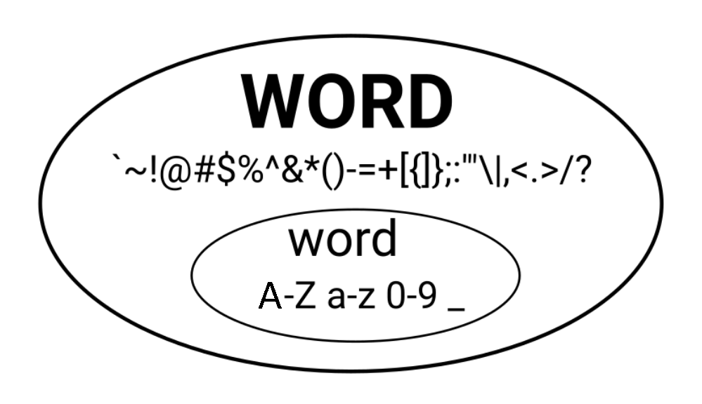

# Vim: The Mighty Text Editor

## What is Vim?
Vim is a keyboard-based, highly configurable text editor.

You might think that text editors are nothing special, but Vim is a unique take on text editors, packed with features that can immensely increase your productivity.

Vim is all about efficiency, as you will see throughout this session.

## Vim Philosophy
- Minimizing hand movements
    - By keeping your hands on the home row and minimizing mouse usage, you can stay in the flow of your work and avoid unnecessary hand movement. This design makes Vim efficient once you get the hang of it.
- Tell Vim what you want to do
    - Instead of doing what you want by yourself, you tell Vim what you want to do.
    - Issue higher level commands to describe the desired outcome
    - Closer to the way your brain thinks, so once you master the basics, you can type as fast as you think. [3]

## Exiting vim
- Exit `:q`
- Exit without saving changes `:q!`

## Moving around
- `h`: Left, `l`: Right
- `j`: Down ,`k`: Up
- `Ctrl-d`: Scroll down half a page.
- `Ctrl-u`: Scroll up half a page.

## Vim Modes
A mode is a way to tell Vim how it should interpret your keystrokes.

- ### Normal mode
    - This is the default mode you start in when you open Vim.
    - This is also where you'll spend most of your time.
    - Press `ESC` to return to Normal mode from any other mode.
    - The keybindings mentioned here to transition other modes assume you are starting from normal mode .

- ### Insert Mode 
    - The mode where you actually type text into your file.
    - There are a few ways to enter insert mode:
        - `i`: Enter insert mode at the location of your cursor.
        - `I`: Enter insert mode at the start of the line.
        - `A`: Enter insert mode at the end of the line.
        - `o`: Start a new line and enter insert mode.
    - To exit insert mode, press `ESC`.
    - To perform one normal mode command while in insert mode, press `Ctrl+o`.

We will explore other modes further in the session.

---

## Learning to speak Vim
Vim is like a language, and learning a language is about 3 things:
1. Grammar
2. Vocabulary
3. Practice

There is only 1 grammar rule in the vim language:

`verb + noun`

For example, `d` (delete) + `w` (word) deletes the next word.

### Nouns 
Nouns in Vim are **motions**.

Typing a noun without a verb before it will just navigate you.

#### Common horizontal motions:
- `w`: Move forward to the start of the next word.
- `W`: Move forward to the start of the next WORD.
- `e`: Move forward to the end of the current word.
- `E`: Move forward to the end of the current WORD.
- `b`: Move backward to the start of the previous word.
- `B`: Move backward to the start of the previous WORD.

    #### Words vs WORDS
    - word: A sequence of letters, digits and underscores.
    - WORD: A sequence of any characters, delimited by whitespace.
        

### Common vertical motions:
- `$`: to the end of the line.
- `0`: to the start of the line
- `gg`: to the start of the file.
- `G`: to the end of the file.
- `%`: Jump to the matching paranthesis.
- `{`: Jump to the previous paragraph.
- `}`: Jump to the next paragraph.

#### Repeating motions
- Preceding a motion with a number repeats it by that number.
- Eg:
    - `3w` moves you 3 words further

### Verbs
- Verbs are operators
    - `y`: Yank (copy)
    - `d`: Delete and save to register
    - `c`: Change (delete, save to register, and enter insert mode)
    - `gU`: Convert to uppercase
    - `gu`: Convert to lowercase
    - `>`: Indent
    - `<`: De-indent
- Generally, by typing the operator command twice, Vim performs the operation on the current line.
    - `dd`: Copy line
    - `gUgU` or `gUU`: Convert line to uppercase
    
### More nouns: text objects
Text objects let you work with specific structures in your document, like a word, sentence, or paragraph, instead of just raw characters.

These can only be used after an operator, or in visual mode (coming soon!).

- `i+object`: Inner text object
    - They select the object inside without the whitespace or surrounding objects.
- `a+object`: Outer text objects
    - They select the object including the white space and surrounding objects.

Example text objects:
    - `w`: Word
    - `W`: WORD
    - `s`: Sentence
    - `p`: Paragraph
    - `t`: XML or HTML tags

---

## Undo and redo

Vim undos and redos **chunks**.

Whenever you go into Insert Mode and then back to Normal Mode, Vim groups those changes into a **chunk**.

- `u`: Undo chunk
- `Ctrl-r`: Redo change

---

## Vim Modes: Continued

### Command Line Mode
- This mode allows you to execute Vim commands.
- It is entered by typing `:` and then your command.
- Some helpful commands are:
    - `set number`: Display line numbers.
    - `:terminal`: Open a terminal within Vim.
    - **Saving changes**
        - Save changes `:w [filename]`
        - Save and exit `:wq [filename]`
    - **Searching**
        - In normal mode:
            - Type `/` followed by your word, then hit `ENTER`
            - Example: `/osc`
            - To go to the next occurence: `n`
            - To go back to the previous occurence:  `N` =`Shift-N`

### Replace Mode
- Everything you type overwrites what was previously written.
- Enter it with `R`=`Shift-r`

### Visual Mode
- `v`: Visual Mode (Character-based) 
- `V`:  Visual Line Mode
- `CTRL + v`: Visual Block Mode

---

# References
1. [Stack Overflow: Why do Vim experts prefer buffers over tabs](https://stackoverflow.com/questions/26708822/why-do-vim-experts-prefer-buffers-over-tabs/26745051)
2. [Learn Vim: Vim Grammar](https://learnvim.irian.to/basics/vim_grammar)
3. [The Philosophy of vim](https://nus-cs1010.github.io/2324-s1/guides/vim-philosophy.html#tell-vim-what-you-want-to-do-dont-do-it-yourself)

--

# Resources
- [BeRoot](https://github.com/Open-Source-Community/BeRoot)
- [The Art of Linux '23](https://github.com/Open-Source-Community/The-Art-of-Linux-23/tree/master/Session5)