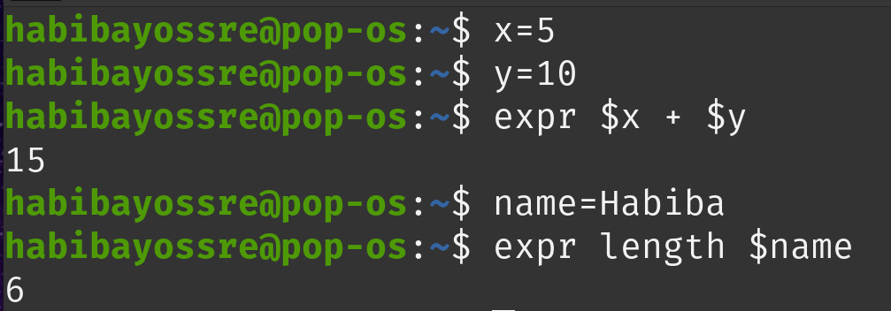

---

marp: true
theme: default
class : invert
paginate: true
style: |
  .columns {
    display: grid;
    grid-template-columns: repeat(2, minmax(0, 1fr));
    gap: 1rem;
  }
---

# **Shell Scripting using Bash**
---

# **Agenda** 


<div class="columns">

<div>

- **What is a shell scripting**
- **How to write & execute a script**
- **Variables**
- **Take User Input**
- **Arithmetic Expansion**
</div>


---

# <p style="text-align:center"> **Terminal VS Shell VS Kernel** </p>

---
## **Terminal:** 

A program which is responsible for providing an interface to a user so that he/she can access the shell.

## **Shell:** 
A shell is a **special user program** that provides an interface for the user to use operating system services. Shell accepts human-readable commands from users and **converts** them into something which the kernel can understand. It is a **command language interpreter** that executes commands read from input devices such as keyboards or from files. The shell gets started when the user logs in or starts the terminal.

---

## **Kernel:**

The kernel is a computer program that is the core of a computer’s operating system, with complete control over everything in the system.

---

<div class="columns">

<div>

# <p style="text-align:center"></p>
# <p style="text-align:center"></p>
# <p style="text-align:center"></p>
# <p style="text-align:center">  </p>
# <p style="text-align:center"></p>
# <p style="text-align:center">  </p>


# <p style="text-align:center"> **Shell VS Kernel** </p>
# <p style="text-align:center">  </p>
# <p style="text-align:center"> </p>

</div>

<div>

# <p style="text-align:center">  </p>

</div>

---

## **How They Work Together**

- You **open a terminal**, which launches a shell.
    
- You **type a command** (e.g., ls), and the shell **processes it**.
- The shell **communicates** with the kernel, which **executes** the command.
- The output is **sent back** to the shell, which **displays** it in the terminal.

---

## **Bash:**

Is one of the most popular shells and is the default on many Linux distributions.

## **Script:**

- A shell script is a text file containing a series of commands that can be executed by the shell.

- **Different Types of Shells** in Linux : sh, zsh, csh, ksh and bash, they differ in features, usability, and scripting capabilities.

---

# <p style="text-align:center"> **How to write & execute a script ?** </p>

---
# Writing a Shell Script

- Create a Script File: Use a text editor (like `nano` or `vim`) to write your script. The file usually has a `.sh` extension, but it's not mandatory.

---

# The Shebang

- The **`#!/path/to/shell`** at the first line of a script is called a Shebang and is used to tell the operating system what shell it should use to execute the commands.

- By typing this line you do not need to specify the shell at the command line before executing the file.

- This should be the first line to write in a script

- **Ignoring Shebang :**
If you do not specify an interpreter line, the default is usually the `/bin/sh`. But, it is recommended that you set `#!/bin/bash` line for your bash scripts.

---

# <p style="text-align:center"> **Executing a Shell Script** </p>

---

- **First Way:**

  ***1. Make the Script Executable:*** Before you can run the script, you need to give it execute permissions using the `chmod` command.

  ```bash
  chmod +x pathToTheFile/my_script.sh
  ```

  ***2. Run the Script:*** You can execute the script by specifying its path.

  ```bash
  pathToTheFile/my_script.sh
  ```

- **Second Way:**

  You can run it by calling the shell explicitly:

  ```bash
  bash pathToTheFile/my_script.sh
  ```

---

# <p style="text-align:center"> **Variables in Bash** </p>

---

# Variables

- Variables names are **case-sensitive** .

- They can only contain **letters** , **numbers** and **underscores** and They can't start with a number.

> The reason you cannot use other characters such as `!`, `*`, or `-` is that these characters have a special meaning for the shell.
---

## **Define a Variable**

- You can define a variable by simply assigning a value to a name **without any spaces** around the **=** sign.

  ```bash
  varname="I Love OSC"
  ```

## **Access Variable Values**

- To access the value stored in a variable, **prefix** the variable name with a **$**.

  ```bash
  echo $varname
  ```

  - **varname** ⇾ refers to the **variable**.
  - **$varname** ⇾ refers to the **value** of the variable.
---
## **Variable Types**

The shell **does not care about types of variables**; they may store ***strings***, ***integers***, real numbers - anything you like. So there is no syntactic difference between:

- `varname="Hello World"`
- `varname=hi`
- `varname=1`
- `varname=3.142`
- `varname="3.142"`
- `varname=123abc`
---
**Command Substitution**: Store the output of a command in a variable using `$(command)`.

```bash
current_date=$(date)
```

---

# **Take User Input**

  - ***Positional Parameters***

  - ***`read` command***

---

# **Positional Parameters** 

special variables used in shell scripting to refer to arguments passed to a script or a function. These parameters are denoted by `$1`, `$2`, `$3`, and so on, where `$1` refers to **the first argument**, `$2` to **the second**, and so forth. `$0` refers to **the name of the script itself**. There are also special parameters like `$#`, `$@` and `$*` that provide additional functionality.

---

## **Special Parameters**

|**Special bash parameter**|**Meaning**|
|---|---|
|`$0`|It's used to reference the name of the shell script.|
|`$1`, `$2`, `$3`, ..| The first, second, third, ... arguments passed to the script.|
|`$#`| The number of arguments passed to the script.|
|`$*`|All the arguments passed to the script, treated as a single string.|

---

- **Example:**
```bash
#!/bin/bash
echo "The total no of args are: $#"
echo "The script name is : $0"
echo "The first argument is : $1"
echo "The second argument is: $2"
echo "The total argument list is: $*"
```
- **Output:**

```bash
osc@osc:~$ ./script.sh 1 2 3 4
The total no of args are: 4
The script name is : script.sh
The first argument is : 1
The second argument is: 2
The total argument list is: 1 2 3 4
```
---

# **`read` Command**

**1. Interactive Input with read:**
The `read` command is used to take input from the user during script execution. This input is then stored in one or more variables.

**2. Handling Spaces:**

When you input a string with spaces using the read command, it automatically quotes the input so that the entire string (including spaces) is treated as a single entity, rather than being split into multiple words or arguments.

---

- **Syntax:**

  ```bash
  read <options> <arguments>
  ```

- **`read` Command Options:**

  - `-p <prompt> ` Outputs the prompt string before reading user input.

  - `-s`: Does not echo the user's input.

---


- **Example 1**


- **Output:**


---

- **Example 2**


- **Output:**


---

# **The Difference between `' '` and `" "`**

---
# **Single Quotes (' ')**

- **Literal Strings:** Everything within single quotes is taken literally. No special characters, variables, or commands are interpreted. ***What you see is what you get***.

- **No Variable Expansion:** Variables inside single quotes are ***not expanded***.

- **No Command Substitution:** Command substitution using backticks (``) or $(...) inside single quotes is ***not performed***.

---

## **Double Quotes (" ")**

- **Partial Literal Strings:** Most characters inside double quotes are taken literally, but certain special characters still have their meaning.

- **Variable Expansion:** Variables inside double quotes are expanded to their values.

- **Command Substitution:** Command substitution within double quotes is performed.

- **Escape Characters:** Certain escape sequences like `\n` (newline), `\t`(tab) are recognized.

---

## **Examples:**


---

# **Break & Asr Time :smile:**

---
# <p style="text-align:center"> **Arithmetic Expansion** </p>

---

- You can do 6 basic arithmetic operators in Bash:

  - `a + b` addition (a plus b)
  - `a - b` subtracting (a minus b)
  - `a * b` multiplication (a times b)
  - `a / b` integer division (a divided by b)
  - `a % b` modulo (the integer remainder of a divided by b)
  - `a ** b` exponentiation (a to the power of b)

---

- We can do Arithmetic Expansion by just enclose any mathematical expression inside double parentheses `$((  ))`.

- **Example 1:**  `a=$((5 - 3 + $b))` 

  Which means: variable a is equal to the value of the expression 5 - 3 + $b


- **Example 2:**


---
# **`expr` Command**

- ***Evaluates a given expression*** and displays its corresponding output. 
- It treats numbers containing a decimal point as strings

- **It is used for:**

  - Basic operations like addition, subtraction, multiplication, division, and modulus on integers.
  - Evaluating regular expressions, string operations like substring, length of strings etc.

---

## **Note that:** 
You need to escape the multiplication `*` operator with a backslash `\` to avoid shell expansion. Otherwise, the shell will try to match the operator (*) with the filenames in the current directory and pass them to the expr command, which **will cause an error**.


---
## **`expr` Command with Operators**

.png)

---

## **`expr` command with variables and string**


---

# **`let` Command**

- `let` is a built-in shell command used for arithmetic evaluation in Bash and other Bourne-like shells. It performs arithmetic operations and assigns the result to a variable.

- **Syntax:**

  ```bash
  let "expression"
  ```
---

# **Examples:**

**1. Arithmetic Operations:**

```bash
let "a = 5 + 3"   # Adds 5 and 3 and assigns the result (8) to variable 'a'
echo $a           # Outputs 8
let "b = a * 2"   # Multiplies 'a' by 2 and assigns the result (16) to variable 'b'
echo $b           # Outputs 16
```


**2. Increment and Decrement:**

```bash
let "i++"         # Increments 'i' by 1
let "j--"         # Decrements 'j' by 1
```

**3. Using Variables:**

```bash
a=5
b=3
let "sum = a + b"   # Adds the values of 'a' and 'b', assigns result to 'sum'
echo $sum           # Outputs 8
```
---

## ***Note That:***

To deal with floating point numbers we can use a tool called `bc` but we will not discuss it in this session.

---

# ***Let's Practise 😊***

**You have only 7 minutes 🏃🏻‍♂️**

---

Write a script that calculates the **area** and **perimeter** of a **rectangle** based on user input.


---

# **Break :smile:**

---

# **Thanks**
